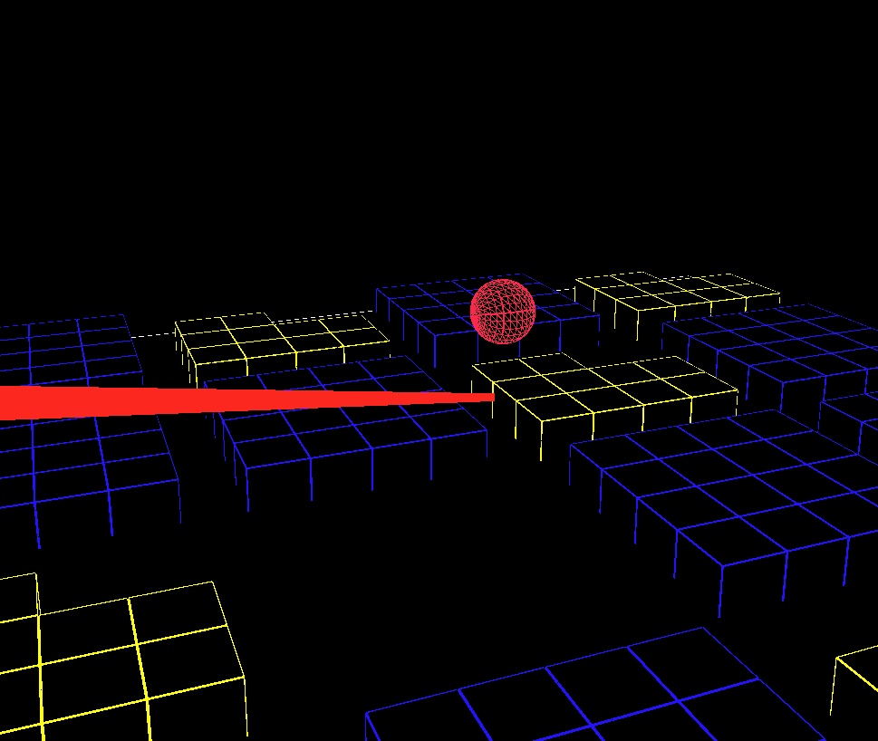

Missile Defense game
===

This is a 3D reimplentation of the classic Missile Command game, in which you
rotate the city with the left and right arrows, and click on the screen to launch
air-burst missiles to try to destory the incoming space rocks de-orbited by the
player of SpaceRocks 2k.

Serve this directory with this command and then go to https://localhost:8000/

```
python -mSimpleHTTPServer 8000
```

* [P5 Reference](https://p5js.org/reference/)
